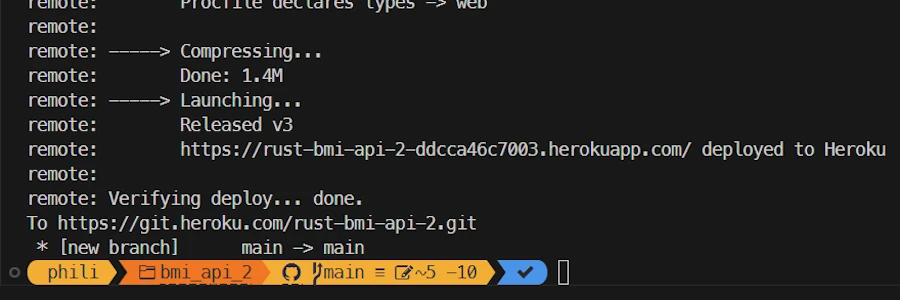
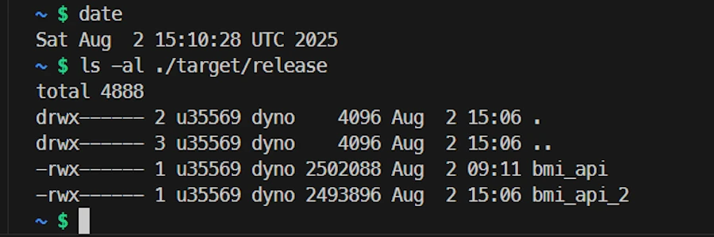
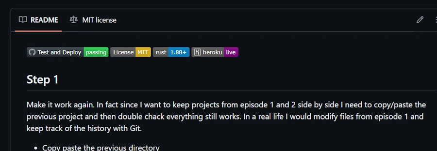

<!-- 
git push heroku main 
-->

<!-- Find the [blog post here](https://www.40tude.fr/docs/06_programmation/rust/011_api_heroku/api_heroku.html). -->


## Step 1
Make it work again. In fact since I want to keep projects from episode 1 and 2 side by side I need to copy/paste the previous project and then double chack everything still works. In a real life I would modify files from episode 1 and keep track of the history with Git.

- Copy paste the previous directory
- Remove the `./.git` directory
- Remove the `./target` directory
- Update `Cargo.toml` to name the project `bmi_api_2`

```
[package]
name = "bmi_api_2"
version = "0.1.0"
edition = "2024"

[dependencies]
axum = "0.8.4"
axum-server = "0.7.2"
reqwest = { version = "0.12.22", features = ["json"] }
serde = { version = "1.0.219", features = ["derive"] }
tokio = { version = "1.47.1", features = ["full"] }

[profile.release]
strip = "symbols"
```

- Publish on GitHub
- Make a test locally
```
cargo run
```

```
curl -X POST http://localhost:8080/bmi  -H "Content-Type: application/json" -d '{"height": 1.69, "weight": 71.0}'

```

<div align="center">

</div>


- Update the Procfile to build and run `bmi_api_2`

```
web: ./target/release/bmi_api_2

```

- Create a project on Heroku
```
heroku create rust-bmi-api-2 --buildpack emk/rust
git remote -v
heroku  https://git.heroku.com/rust-bmi-api-2.git (fetch)
heroku  https://git.heroku.com/rust-bmi-api-2.git (push)
origin  https://github.com/40tude/bmi_api_2.git (fetch)
origin  https://github.com/40tude/bmi_api_2.git (push)
```

- No need to get a new token (`heroku auth:token`)
- Directly deploy on Heroku

```
git push heroku main
```

<div align="center">

</div>

- Copy the URL (here, `https://rust-bmi-api-2-ddcca46c7003.herokuapp.com/`)
- Open `./examples/client.rs` and paste the copied URL

```rust
    let url = "https://rust-bmi-api-2-ddcca46c7003.herokuapp.com/bmi";
```
- Make a test with the client
```
cargo run --example client
```

<div align="center">

</div>


At this stage we are in good shape
- The app has been renamed
- The project is on GitHub
- The code runs locally
- The API Server can be deployed on Heroku with a simple "push"
- Clients (curl, web, Rust apps) can use the API

Now the aim of the game is :
- To add testings
- To run the tests every time we push on GitHub
- Push on Heroku only when the test are OK

The good news is that it is possible. The bad news is that it require to reorganize the files.
At this point, the project directory looks like :

```
.
├── examples/
│   └── client.rs      
└── src/
    └── main.rs       
```

Everything is in the `main.rs` file and this does not facilitate testing. Below is the new organization

```
.
├── examples/
│   └── client.rs      
├── src/
│   ├── main.rs      ⟵ code to launch the app
│   ├── lib.rs       ⟵ where we declare the modules (ex: api)
│   └── api.rs       ⟵ BMI + struct request/response
└── tests/
    └── api.rs       ⟵ test which use /src/api.rs

```


## Step 2
Create a file `src/lib.rs` and copy/paste the code below

```rust
// src/lib.rs
pub mod api;
```


## Step 3
Modify `main.rs` as below so that it calls functions (here, `api::calculate_bmi()`) from the `api.rs` module

```rust
use axum::{Router, http::StatusCode, response::IntoResponse, routing::post};
use bmi_api::api::calculate_bmi;
use std::net::SocketAddr;

async fn health_check() -> impl IntoResponse {
    (StatusCode::OK, "BMI API is up and running")
}

#[tokio::main]
async fn main() {
    let app = Router::new().route("/bmi", post(calculate_bmi)).route("/", axum::routing::get(health_check));

    let port = std::env::var("PORT").unwrap_or_else(|_| "8080".to_string()).parse().expect("PORT must be a number");
    let addr = SocketAddr::from(([0, 0, 0, 0], port));

    println!("Listening on {addr}");

    axum_server::bind(addr).serve(app.into_make_service()).await.unwrap();
}
```


## Step 4
Modyfy `Cargo.toml` as below


```
[package]
name = "bmi_api_2"
version = "0.1.0"
edition = "2024"

[dependencies]
axum = "0.8.4"
axum-server = "0.7.2"
reqwest = { version = "0.12.22", features = ["json"] }
serde = { version = "1.0.219", features = ["derive"] }
tokio = { version = "1.47.1", features = ["full"] }

[lib]
name = "bmi_api"
path = "src/lib.rs"

[profile.release]
strip = "symbols"
```


## Step 5

Create a file `src/api.rs` and copy/paste the code below

```rust
use axum::{Json, http::StatusCode};
use serde::{Deserialize, Serialize};

// Structure for request body
#[derive(Deserialize)]
pub struct BmiRequest {
    pub height: f32,
    pub weight: f32,
}

// Structure for response body
#[derive(Serialize, Deserialize)] 
pub struct BmiResponse {
    pub bmi: f32,
}

// Handler for the /bmi endpoint
pub async fn calculate_bmi(Json(payload): Json<BmiRequest>) -> Result<Json<BmiResponse>, (StatusCode, String)> {
    if payload.height <= 0.0 {
        return Err((StatusCode::BAD_REQUEST, "Height must be > 0".into()));
    }

    if payload.weight <= 0.0 {
        return Err((StatusCode::BAD_REQUEST, "Weight must be > 0".into()));
    }

    let bmi = payload.weight / (payload.height * payload.height);
    Ok(Json(BmiResponse { bmi: (bmi * 100.0).round() / 100.0 }))
}
```


## Step 6

```
cargo add tower
cargo add serde-json
```

Create a `/tests/api.rs` file with the following content.

```rust
use axum::body::to_bytes;
use axum::{
    Router,
    body::Body,
    http::{Request, StatusCode},
    routing::post,
};
// use bmi_api::api::{BmiRequest, BmiResponse, calculate_bmi};
use bmi_api::api::{BmiResponse, calculate_bmi};
use tower::ServiceExt;

fn app() -> Router {
    Router::new().route("/bmi", post(calculate_bmi))
}

#[tokio::test]
async fn test_zero_weight_should_fail() {
    let app = app();

    let payload = r#"{ "height": 1.75, "weight": 0.0 }"#;
    let request = Request::builder()
        .method("POST")
        .uri("/bmi")
        .header("Content-Type", "application/json")
        .body(Body::from(payload))
        .unwrap();

    let response = app.oneshot(request).await.unwrap();

    assert_eq!(response.status(), StatusCode::BAD_REQUEST);
}

#[tokio::test]
async fn test_valid_bmi_should_succeed() {
    let app = app();

    let payload = r#"{ "height": 1.75, "weight": 70.0 }"#;
    let request = Request::builder()
        .method("POST")
        .uri("/bmi")
        .header("Content-Type", "application/json")
        .body(Body::from(payload))
        .unwrap();

    let response = app.oneshot(request).await.unwrap();

    // Check HTTP 200
    assert_eq!(response.status(), StatusCode::OK);

    // Extract JSON body
    let body = to_bytes(response.into_body(), usize::MAX).await.unwrap();
    let parsed: BmiResponse = serde_json::from_slice(&body).unwrap();

    // Check BMI value (rounded to 2 decimals)
    assert!((parsed.bmi - 22.86).abs() < 0.01, "Expected ≈22.86, got {}", parsed.bmi);
}
```


- Publish on GitHub
- Make a test locally

```
cargo run
```

<div align="center">

</div>


```
curl -X POST http://localhost:8080/bmi  -H "Content-Type: application/json" -d '{"height": 1.69, "weight": 71.0}'

```

<div align="center">

</div>


```
cargo test  

```


<div align="center">

</div>


## Step 7

Create `.github/workflows/test-and-deploy.yml`
Copy the code below

```yml
name: Test and Deploy

on:
  push:
    branches: [ main ]

jobs:
  test:
    runs-on: ubuntu-latest
    steps:
      - uses: actions/checkout@v4
      - uses: actions-rs/toolchain@v1
        with:
          toolchain: stable
          profile: minimal
          override: true
      - name: Run tests
        run: cargo test

  deploy:
    needs: test
    runs-on: ubuntu-latest
    if: ${{ success() }}
    steps:
      - uses: actions/checkout@v4
      - name: Install Heroku CLI
        run: curl https://cli-assets.heroku.com/install.sh | sh
      - name: Deploy to Heroku
        env:
          HEROKU_API_KEY: ${{ secrets.HEROKU_API_KEY }}
        run: |
          heroku git:remote -a rust-bmi-api-2-ddcca46c7003
          git push heroku HEAD:main -f


```

We need to add the Heroku token to GitHub. Let's get back the token

```
heroku auth:token
»   Warning: token will expire 08/30/2025
»   To generate a token that expires in one year, use heroku authorizations:create.
HRKU-AAYLneWaZt-hqJ7cqwH3Ou_...

```

- Copy the token
- Open GitHub repo
- GitHub → Settings → Secrets and variables → Actions → New repository secret :

Name: HEROKU_API_KEY
Value: Past the token value you got with `heroku auth:token`


<div align="center">

</div>


Commit on GitHub


## Build the API
The API is simple. It returns your bmi (body mass index) once it received your height and weight. 

In the parent directory of the project, open a terminal (WIN + X then I) then enter the following commands 

```
cargo new bmi_api
cd bmi_api
code .
```

In VSCode, open the integrated terminal (CTRL + ù) 

```
cargo add axum
cargo add axum_server
cargo add serde --features derive 
cargo add tokio --features full 
```
`Cargo.toml` should now be similar to : 

```
[package]
name = "bmi_api"
version = "0.1.0"
edition = "2024"

[dependencies]
axum = "0.8.4"
axum-server = "0.7.2"
serde = { version = "1.0.219", features = ["derive"] }
tokio = { version = "1.47.1", features = ["full"] }

```

Open and review the file `main.rs`. It looks like :

```rust
use axum::{Json, Router, routing::post};
use axum::{http::StatusCode, response::IntoResponse};
use serde::{Deserialize, Serialize};
use std::net::SocketAddr;

// Structure for request body
#[derive(Deserialize)]
struct BmiRequest {
    height: f32, // in meters
    weight: f32, // in kilograms
}

// Structure for response body
#[derive(Serialize)]
struct BmiResponse {
    bmi: f32,
}

// Handler for the /bmi endpoint
async fn calculate_bmi(Json(payload): Json<BmiRequest>) -> Result<Json<BmiResponse>, (StatusCode, String)> {
    if payload.height <= 0.0 {
        return Err((StatusCode::BAD_REQUEST, "Height must be > 0".into()));
    }

    let bmi = payload.weight / (payload.height * payload.height);
    Ok(Json(BmiResponse { bmi: (bmi * 100.0).round() / 100.0 }))
}

// Handler for the / endpoint
async fn health_check() -> impl IntoResponse {
    (StatusCode::OK, "BMI API is up and running")
}

#[tokio::main]
async fn main() {
    // Define the router and route
    let app = Router::new().route("/bmi", post(calculate_bmi)).route("/", axum::routing::get(health_check));

    // Heroku provides $PORT env variable
    let port = std::env::var("PORT").unwrap_or_else(|_| "8080".to_string()).parse().expect("PORT must be a number");

    let addr = SocketAddr::from(([0, 0, 0, 0], port));
    println!("Listening on {addr}");

    axum_server::bind(addr).serve(app.into_make_service()).await.unwrap();
}
```


Let's make a test locally. In VSCode, in the integrated terminal enter the following command :

```
cargo run
```


### Local test with a web browser 
{: .no_toc }

`http://localhost:8080/`

<div align="center">

</div>

This is `http`, NOT `https`.

### Local test with Curl
{: .no_toc }

`curl -X GET  http://localhost:8080/ `

<div align="center">

</div>


### Local test with Curl
{: .no_toc }

`curl -X POST http://localhost:8080/bmi  -H "Content-Type: application/json" -d '{"height": 1.69, "weight": 71.0}'`

<div align="center">

</div>


## Prepare for Heroku
The aim of the game is
1. To have a repo on GitHub to host our project (business as usual) 
1. Similarly, to have a repo on Heroku in order to provide to Heroku what is needed to build and run the API server. Once everything will be configured we will only have to "push" on Heroku, and let it work (build and run the server).

### Create a `Procfile` file
{: .no_toc }

* The `Procfile` must be at the root of the project and it explains how to build and start the app 
* It is mandatory here since applications made with Rust do not follow a standard "buildpack"
* `Procfile` contains one line : `web: ./target/release/bmi_api`
    * `web` : kind of process (here, web server)
    * `./target/release/bmi_api` : the command to execute to start the app


### Create a `.slugignore` file
{: .no_toc }

* Similar to `.gitignore` this helps to send to Heroku only what is needed
* At this point `.slugignore` should be similar to :

```
/.git
/target
README.md
```	

It is time to commit on GitHub. You can either use the integrated terminal or use VSCode features.

<div align="center">

</div>


If not yet done, it is time to [install Heroku CLI](https://devcenter.heroku.com/articles/heroku-cli). Heroku does not allow "_" in project name. So make sure to use "-" to name your project instead. In VSCode integrated terminal type : 

```
heroku create rust-bmi-api --buildpack emk/rust
```
In the line above, note that the name on the Heroku's dashboard is `rust-bmi-api` (with `-`) but the app (the API/web server) is named `bmi_api`. You can double check `Cargo.toml` and/or `Procfile`.

Let's double check which gits are configured for this project. 

```
git remote -v
```

You should see, something like to :

```
heroku  https://git.heroku.com/rust-bmi-api.git (fetch)
heroku  https://git.heroku.com/rust-bmi-api.git (push)
origin  https://github.com/40tude/bmi_api.git (fetch)
origin  https://github.com/40tude/bmi_api.git (push)
```

<div align="center">

</div>


## Push on Heroku
It might be a bit tricky because of the identification process. Indeed, Heroku no longer accepts passwords for git push. We must use the Heroku token as our password. You can read the [page](https://devcenter.heroku.com/articles/authentication). Once the token (see below how to get one) is entered, check “Remember” so you don't have to do it again.

Let's get a token :

```
heroku auth:token
``` 
Select and copy the token. Now, we can push on Heroku :

```
git push heroku main
```
When the dialog box popup, enter ANY name and paste the token. Files are sent, the build process starts and the server is launched.

<!-- git config --global credential.helper cache   
git config --global --unset credential.helper 
git config --global --get credential.helper # verification
-->


<div align="center">

</div>

At the end of the build, select and copy the URL. Here : `https://rust-bmi-api-b4fd519caa8f.herokuapp.com/`


### Test with a web browser 
{: .no_toc }

Paste the copied URL in your browser (here, `https://rust-bmi-api-b4fd519caa8f.herokuapp.com/`). You should see :

<div align="center">

</div>


### Test with Curl
{: .no_toc }

```
curl -X POST https://rust-bmi-api-b4fd519caa8f.herokuapp.com/bmi  -H "Content-Type: application/json" -d '{"height": 1.69, "weight": 71.0}' 
```

<div align="center">

</div>


## Client (Rust)
Let's write a client in Rust. In VSCode, in the integrated terminal type in :

```
cargo add reqwest --features json 
```

Review `examples/client.rs`. It should looks like : 

```rust
use serde::{Deserialize, Serialize};

// Structure for request payload
#[derive(Serialize)]
struct BmiRequest {
    height: f32,
    weight: f32,
}

// Structure for response payload
#[derive(Deserialize)]
struct BmiResponse {
    bmi: f32,
}

#[tokio::main]
async fn main() -> Result<(), Box<dyn std::error::Error>> {
    let url = "https://rust-bmi-api-b4fd519caa8f.herokuapp.com/bmi";

    // Example data
    let request_body = BmiRequest { height: 1.69, weight: 69.0 };

    // Create the HTTP client
    let client = reqwest::Client::new();

    // Send the POST request with JSON body
    let response = client.post(url).json(&request_body).send().await?;

    // Ensure status is OK
    if !response.status().is_success() {
        eprintln!("Request failed with status: {}", response.status());
        return Ok(());
    }

    // Deserialize JSON response
    let bmi_response: BmiResponse = response.json().await?;

    println!("BMI = {:.2}", bmi_response.bmi);

    Ok(())
}
```
In the code above you may have to modify the hard coded url (see the line `let url = "https://rust-bmi-api-b4fd519caa8f.herokuapp.com/bmi";`) with the one corresponding to your server.

Since there is no need to send the code of the client to Heroku, add `/examples` to `.slugignore`. It now should looks like :

```
/.git
/target
README.md
/examples
```

It is time to run the client locally and see if it can contact the API on Heroku. In the integrated terminal type in :

```
cargo run --example client
``` 

<div align="center">

</div>


## Reduce the size of the app on Heroku

You can see which files have been deployed and built on Heroku. In VSCode integrated terminal type in : 
```powershell
heroku run bash
``` 

Once the `$` type `ls -al ./target/release/`. The server is 3MB. Pretty fat...

```
$ ls -al ./target/release/
total 3128
drwx------ 2 u58927 dyno    4096 Aug  1 14:00 .
drwx------ 3 u58927 dyno    4096 Aug  1 14:00 ..
-rwx------ 1 u58927 dyno 3192720 Aug  1 14:00 bmi_api
$ exit 
```

<div align="center">

</div>

In order to reduce the size of the application we can add the following sections in `Cargo.toml`

```
[profile.release]
strip = "symbols"
```

- Then we commit to GitHub
- Finally, we push onto Heroku (`git push heroku main`)
- When the API server is up and running we can check its new size

```
heroku run bash
$ ls -al ./target/release/
total 2452
drwx------ 2 u52596 dyno    4096 Jul 31 17:10 .
drwx------ 3 u52596 dyno    4096 Jul 31 17:10 ..
-rwx------ 1 u52596 dyno 2502088 Jul 31 17:10 bmi_api
$ exit
```

<div align="center">

</div>


## Conclusion
- Again the is just a check list
- The point was NOT to explain the code of API server (it is similar to what can be done with FastAPI in Python)
- The idea was to show how to setup a Rust project so that it can be tested locally and easily pushed on Heroku
- I hope this will help to start

In the next episode `bmi_api_2` we will see how to add testing and to push on Heroku only when the tests are OK. This requires a reorganization among the files. 