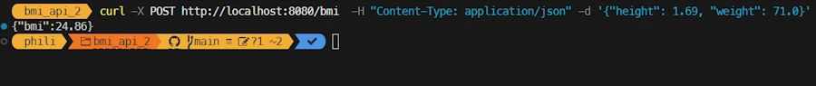

<!-- 
git push heroku main 
-->

<!-- Find the [blog post here](https://www.40tude.fr/docs/06_programmation/rust/011_api_heroku/api_heroku.html). -->


## Step 1
Make it work again. In fact since I want to keep projects from episode 1 and 2 side by side I need to copy/paste the previous project and then double chack everything still works. In a real life I would modify files from episode 1 and keep track of the history with Git.

- Copy paste the previous directory
- Remove the `./.git` directory
- Remove the `./target` directory
- Update `Cargo.toml` to name the project `bmi_api_2`

```
[package]
name = "bmi_api_2"
version = "0.1.0"
edition = "2024"

[dependencies]
axum = "0.8.4"
axum-server = "0.7.2"
reqwest = { version = "0.12.22", features = ["json"] }
serde = { version = "1.0.219", features = ["derive"] }
tokio = { version = "1.47.1", features = ["full"] }

[profile.release]
strip = "symbols"
```

- Publish on GitHub
- Make a test locally
```
cargo run
```

```
curl -X POST http://localhost:8080/bmi  -H "Content-Type: application/json" -d '{"height": 1.69, "weight": 71.0}'

```

<div align="center">

</div>


- Update the Procfile to build and run `bmi_api_2`

```
web: ./target/release/bmi_api_2

```

- Create a project on Heroku
```
heroku create rust-bmi-api-2 --buildpack emk/rust
git remote -v
heroku  https://git.heroku.com/rust-bmi-api-2.git (fetch)
heroku  https://git.heroku.com/rust-bmi-api-2.git (push)
origin  https://github.com/40tude/bmi_api_2.git (fetch)
origin  https://github.com/40tude/bmi_api_2.git (push)
```

- No need to get a new token (`heroku auth:token`)
- Directly deploy on Heroku

```
git push heroku main
```

<div align="center">

</div>

- Copy the URL (here, `https://rust-bmi-api-2-ddcca46c7003.herokuapp.com/`)
- Open `./examples/client.rs` and paste the copied URL

```rust
    let url = "https://rust-bmi-api-2-ddcca46c7003.herokuapp.com/bmi";
```
- Make a test with the client
```
cargo run --example client
```

<div align="center">

</div>


At this stage we are in good shape
- The app has been renamed
- The project is on GitHub
- The code runs locally
- The API Server can be deployed on Heroku with a simple "push"
- Clients (curl, web, Rust apps) can use the API

Now the aim of the game is :
- To add testings
- To run the tests every time we push on GitHub
- Push on Heroku only when the test are OK

The good news is that it is possible. The bad news is that it require to reorganize the files.
At this point, the project directory looks like :

```
.
├── examples/
│   └── client.rs      
└── src/
    └── main.rs       
```

Everything is in the `main.rs` file and this does not facilitate testing. Below is the new organization

```
.
├── examples/
│   └── client.rs      
├── src/
│   ├── main.rs      ⟵ code to launch the app
│   ├── lib.rs       ⟵ where we declare the modules (ex: api)
│   └── api.rs       ⟵ BMI + struct request/response
└── tests/
    └── api.rs       ⟵ test which use /src/api.rs

```


## Step 2
Create a file `src/lib.rs` and copy/paste the code below

```rust
// src/lib.rs
pub mod api;
```


## Step 3
Modify `main.rs` as below so that it calls functions (here, `api::calculate_bmi()`) from the `api.rs` module

```rust
use axum::{Router, http::StatusCode, response::IntoResponse, routing::post};
use bmi_api::api::calculate_bmi;
use std::net::SocketAddr;

async fn health_check() -> impl IntoResponse {
    (StatusCode::OK, "BMI API is up and running")
}

#[tokio::main]
async fn main() {
    let app = Router::new().route("/bmi", post(calculate_bmi)).route("/", axum::routing::get(health_check));

    let port = std::env::var("PORT").unwrap_or_else(|_| "8080".to_string()).parse().expect("PORT must be a number");
    let addr = SocketAddr::from(([0, 0, 0, 0], port));

    println!("Listening on {addr}");

    axum_server::bind(addr).serve(app.into_make_service()).await.unwrap();
}
```


## Step 4
Modyfy `Cargo.toml` as below


```
[package]
name = "bmi_api_2"
version = "0.1.0"
edition = "2024"

[dependencies]
axum = "0.8.4"
axum-server = "0.7.2"
reqwest = { version = "0.12.22", features = ["json"] }
serde = { version = "1.0.219", features = ["derive"] }
tokio = { version = "1.47.1", features = ["full"] }

[lib]
name = "bmi_api"
path = "src/lib.rs"

[profile.release]
strip = "symbols"
```


## Step 5

Create a file `src/api.rs` and copy/paste the code below

```rust
use axum::{Json, http::StatusCode};
use serde::{Deserialize, Serialize};

// Structure for request body
#[derive(Deserialize)]
pub struct BmiRequest {
    pub height: f32,
    pub weight: f32,
}

// Structure for response body
#[derive(Serialize, Deserialize)] 
pub struct BmiResponse {
    pub bmi: f32,
}

// Handler for the /bmi endpoint
pub async fn calculate_bmi(Json(payload): Json<BmiRequest>) -> Result<Json<BmiResponse>, (StatusCode, String)> {
    if payload.height <= 0.0 {
        return Err((StatusCode::BAD_REQUEST, "Height must be > 0".into()));
    }

    if payload.weight <= 0.0 {
        return Err((StatusCode::BAD_REQUEST, "Weight must be > 0".into()));
    }

    let bmi = payload.weight / (payload.height * payload.height);
    Ok(Json(BmiResponse { bmi: (bmi * 100.0).round() / 100.0 }))
}
```


## Step 6

```
cargo add tower
cargo add serde-json
```

Create a `/tests/api.rs` file with the following content.

```rust
use axum::body::to_bytes;
use axum::{
    Router,
    body::Body,
    http::{Request, StatusCode},
    routing::post,
};
// use bmi_api::api::{BmiRequest, BmiResponse, calculate_bmi};
use bmi_api::api::{BmiResponse, calculate_bmi};
use tower::ServiceExt;

fn app() -> Router {
    Router::new().route("/bmi", post(calculate_bmi))
}

#[tokio::test]
async fn test_zero_weight_should_fail() {
    let app = app();

    let payload = r#"{ "height": 1.75, "weight": 0.0 }"#;
    let request = Request::builder()
        .method("POST")
        .uri("/bmi")
        .header("Content-Type", "application/json")
        .body(Body::from(payload))
        .unwrap();

    let response = app.oneshot(request).await.unwrap();

    assert_eq!(response.status(), StatusCode::BAD_REQUEST);
}

#[tokio::test]
async fn test_valid_bmi_should_succeed() {
    let app = app();

    let payload = r#"{ "height": 1.75, "weight": 70.0 }"#;
    let request = Request::builder()
        .method("POST")
        .uri("/bmi")
        .header("Content-Type", "application/json")
        .body(Body::from(payload))
        .unwrap();

    let response = app.oneshot(request).await.unwrap();

    // Check HTTP 200
    assert_eq!(response.status(), StatusCode::OK);

    // Extract JSON body
    let body = to_bytes(response.into_body(), usize::MAX).await.unwrap();
    let parsed: BmiResponse = serde_json::from_slice(&body).unwrap();

    // Check BMI value (rounded to 2 decimals)
    assert!((parsed.bmi - 22.86).abs() < 0.01, "Expected ≈22.86, got {}", parsed.bmi);
}
```


- Publish on GitHub
- Make a test locally

```
cargo run
```

<div align="center">

</div>


```
curl -X POST http://localhost:8080/bmi  -H "Content-Type: application/json" -d '{"height": 1.69, "weight": 71.0}'

```

<div align="center">

</div>


```
cargo test  

```


<div align="center">

</div>


## Step 7

Create `.github/workflows/test-and-deploy.yml`
Copy the code below

```yml
name: Test and Deploy

on:
  push:
    branches: [ main ]

jobs:
  test:
    runs-on: ubuntu-latest
    steps:
      - uses: actions/checkout@v4
      - uses: actions-rs/toolchain@v1
        with:
          toolchain: stable
          profile: minimal
          override: true
      - name: Run tests
        run: cargo test

  deploy:
    needs: test
    runs-on: ubuntu-latest
    if: ${{ success() }}
    steps:
      - uses: actions/checkout@v4
      - name: Install Heroku CLI
        run: curl https://cli-assets.heroku.com/install.sh | sh
      - name: Deploy to Heroku
        env:
          HEROKU_API_KEY: ${{ secrets.HEROKU_API_KEY }}
        run: |
          heroku git:remote -a rust-bmi-api-2
          git push heroku HEAD:main -f


```
In the script above, make sure to update the `heroku git:remote -a rust-bmi-api-2` with 

We need to add the Heroku token to GitHub. Let's get back the token

```
heroku auth:token
»   Warning: token will expire 08/30/2025
»   To generate a token that expires in one year, use heroku authorizations:create.
HRKU-AAYLneWaZt-hqJ7cqwH3Ou_...

```

- Copy the token
- Open GitHub repo
- GitHub → Settings → Secrets and variables → Actions → New repository secret :

Name: HEROKU_API_KEY
Value: Past the token value you got with `heroku auth:token`


<div align="center">

</div>


Commit on GitHub


